<div align="center">
  
</div>

<div align="center">
  
  [](https://git.io/typing-svg)
  
</div>

---

## 👩‍💻 About Me

```python
class MerveSevim:
    def __init__(self):
        self.username = "MerveSevim44"
        self.role = "Computer Engineering Student"
        self.education = "3rd Year | Computer Engineering"
        self.interests = [
            "Artificial Intelligence",
            "Deep Learning",
            "Computer Vision", 
            "Cybersecurity",
            "Medical AI"
        ]
        self.current_focus = "Building intelligent systems"
        self.location = "Istanbul, Turkey 🇹🇷"
    
    def get_daily_routine(self):
        return "Code 💻 | Learn 📚 | Innovate 🚀 | Repeat 🔄"
```

<div align="center">

### 🎯 Current Focus

🔬 Researching advanced AI architectures and neural networks  
🦷 Developing dental caries detection systems with U-Net  
🔐 Exploring ethical hacking and penetration testing  
🌱 Learning cutting-edge machine learning frameworks  

</div>

---

## 🚀 Featured Projects

<table align="center">
  <tr>
    <td align="center" width="33%">
      
      <br>
      <b>🦷 Dental Caries Detection</b>
      <br>
      <sub>U-Net Architecture</sub>
      <br>
      <sub>70% Dice Score</sub>
      <br>
      <sub>Medical AI Solution</sub>
    </td>
    <td align="center" width="33%">
      
      <br>
      <b>🧠 Deep Learning Projects</b>
      <br>
      <sub>Neural Networks</sub>
      <br>
      <sub>CNNs & Computer Vision</sub>
      <br>
      <sub>PyTorch & TensorFlow</sub>
    </td>
    <td align="center" width="33%">
      
      <br>
      <b>🔒 Security Research</b>
      <br>
      <sub>Penetration Testing</sub>
      <br>
      <sub>Vulnerability Assessment</sub>
      <br>
      <sub>Threat Detection</sub>
    </td>
  </tr>
</table>

---

## 🛠️ Technology Stack

<div align="center">

### Languages & Frameworks


### AI & Data Science


### Tools & Platforms


</div>

---

## 📊 GitHub Statistics

<div align="center">
  
  
</div>

<div align="center">
  
</div>

<div align="center">
  
</div>

---

## 🎯 Skills & Expertise

```mermaid
mindmap
  root((Merve Sevim))
    🤖 Artificial Intelligence
      Machine Learning
      Deep Learning
      Computer Vision
      Neural Networks
    🔒 Cybersecurity
      Ethical Hacking
      Penetration Testing
      Security Analysis
      Threat Detection
    📊 Data Science
      Data Analysis
      Statistical Modeling
      Data Visualization
      Predictive Analytics
    💻 Software Development
      Algorithm Design
      Problem Solving
      Code Optimization
      System Architecture
```

<div align="center">



</div>

---

## 🏆 Achievements & Highlights

<div align="center">

| 🎓 **Education** | 🔬 **Research** | 💡 **Innovation** |
|:---:|:---:|:---:|
| Computer Engineering | Medical AI Projects | Open Source Contributor |
| 3rd Year Student | 70% Dice Score U-Net | Problem Solver |
| AI Specialization | Computer Vision | Creative Thinker |

</div>

---

## 🌐 Connect With Me

<div align="center">
  
[](https://www.linkedin.com/in/merve-sevim-aa8797231)
[](https://github.com/MerveSevim44)
[](mailto:your.email@example.com)

</div>

---

## 💭 Quote

<div align="center">
  
  ### *"The best way to predict the future is to invent it."*
  
  <sub>— Alan Kay</sub>
  
</div>

---

<div align="center">
  
  
  
  ### Thank you for visiting! ⭐
  
  <sub>Made with 💜 by Merve Sevim</sub>
  
</div>

<div align="center">
  
</div>
