  

  

---

## 🙋‍♀️ About Me

🎓 Third-Year Computer Engineering Student with a passion for innovation and technology

🔬 Research Interests: Machine Learning • Deep Learning • Computer Vision • Cybersecurity

🏆 Current Focus: Developing intelligent systems that make a real-world impact

🌱 Currently Exploring: Advanced AI architectures and ethical hacking

 

---

## 🚀 Featured Projects

| 🦷 **Dental Caries Detection** | 🧠 **Deep Learning Suite** | 🔒 **Security Tools** |
|:---:|:---:|:---:|
| U-Net Architecture | Neural Networks | Penetration Testing |
| 70% Dice Score | Multi-layer CNNs | Vulnerability Assessment |
| Medical AI | Computer Vision | Threat Detection |

---

## 🛠️ Tech Arsenal

### Programming Languages

### AI & Machine Learning

### Tools & Platforms

---

## 📊 GitHub Analytics

  
  

  

  

---

## 🎯 What Drives Me

```mermaid
mindmap
  root((Merve))
    🤖 AI/ML
      Deep Learning
      Computer Vision
      Neural Networks
    🔒 Cybersecurity
      Penetration Testing
      Threat Analysis
      Security Research
    📊 Data Science
      Statistical Analysis
      Data Visualization
      Predictive Modeling
    🚀 Innovation
      Problem Solving
      Creative Solutions
      Future Tech
```

---

## 🌐 Let's Connect!

---

## 💡 Fun Facts & Interests

| 📚 **Reading** | 🛰️ **Space Tech** | 🔒 **Cybersecurity** | 🏥 **Health Tech** |
|:---:|:---:|:---:|:---:|
| Sci-Fi Novels | Astronomy | Ethical Hacking | Medical AI |
| Tech Books | Space Missions | Security Research | Bioinformatics |
| Research Papers | Astrophysics | Cryptography | Healthcare Innovation |

---

  
  
  ### 🚀 *"Code is poetry, and I'm here to write the next masterpiece!"* 🚀
  
  
  

---

  

